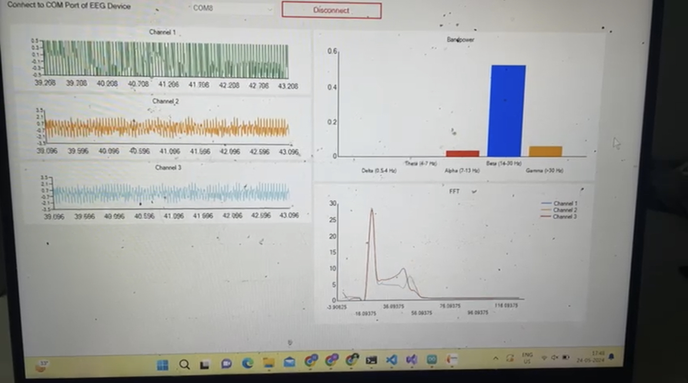

# ECG Acquizition and Visualization System
This is a EEG Acquizition system based on Raspberry Pi Pico and ADS1299. For more details on ADS1299 and the SPI interface kindly refer to the datasheet. The acquired signals are transmitted to the host system where the software in the GUI can be used for vizualization and signal processing

## Steps to setup:
- Compile and flash Raspberry Pi Pico with the main.ino file.
- Run the GUI software and see the bandpower, FFT and time series data of the EEG channels can be visualized at realtime.
